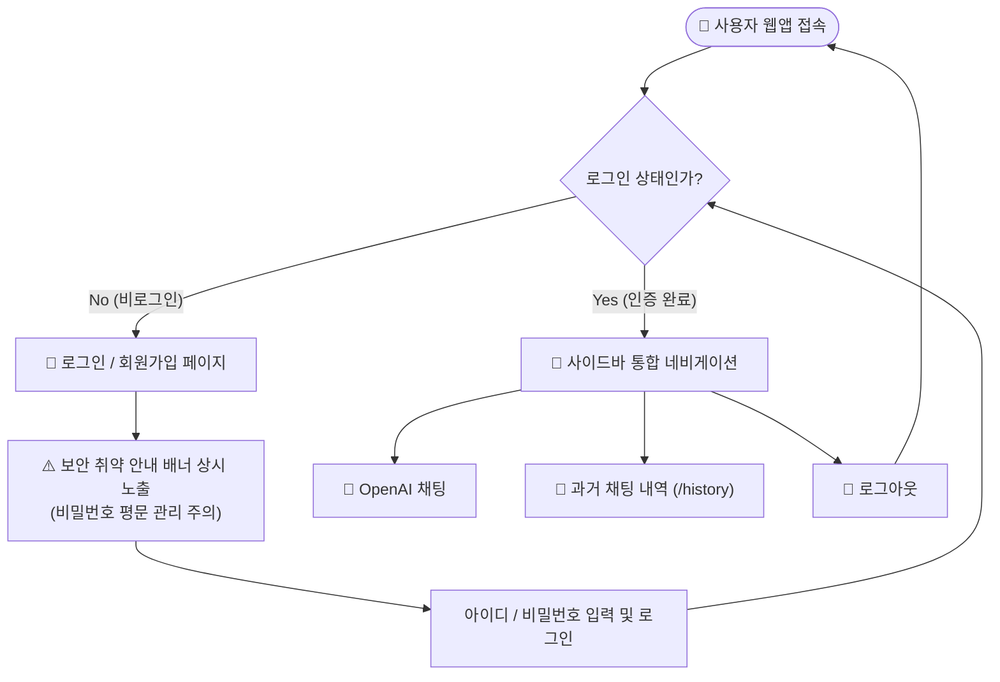
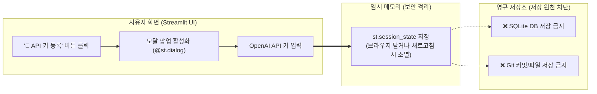
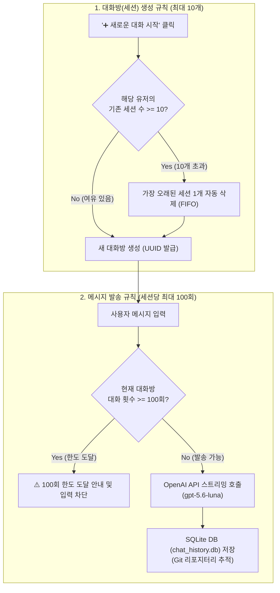
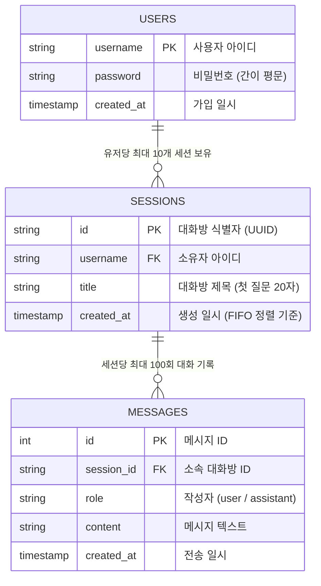

# OpenAI 채팅 앱 기능 개선 및 로그인 시스템 구현 계획서

사용자 요청에 따라 OpenAI API 키 동적 등록(메모리 전용), 파일 업로드 제거, Git 추적 SQLite DB, 세션/대화 횟수 제한(최대 10개 세션 / 세션당 100회 대화), 간이 로그인 시스템 및 보안 안내를 반영한 계획서입니다.

---

## 🗺️ 기능도 및 시스템 흐름도

### 1. 사용자 인증 및 시스템 진입 흐름 (Auth Flow)

---

### 2. OpenAI API 키 등록 및 보안 격리 흐름 (API Key Security)

> **핵심 원칙**: API 키는 **오직 Streamlit 메모리(`st.session_state`)**에만 임시 보관되며, 어떠한 파일이나 DB에도 기록되지 않습니다.

---

### 3. 세션 수 (10개) 및 대화 턴 수 (100회) 제약 조건 흐름 (Lifecycle)

---

### 4. 데이터베이스 관계도 (ERD)

---

## 📋 세부 구현 명세

### 1. 보안 정책
- **API 키 메모리 유지**: `st.session_state.openai_api_key`에만 보관하고, DB나 `.env` 등 파일에 기록하지 않음.
- **간이 로그인 보안 한계 고지**: 암호화되지 않은 간이 계정 시스템임을 안내하는 상시 경고 배너 노출.

### 2. 세션 및 대화 제한
- **유저당 최대 10개 세션**: 11번째 세션 생성 시 가장 오래된 세션 및 관련 메시지를 DB에서 자동 삭제.
- **세션당 100회 대화 한도**: 사용자 질문과 AI 답변 1세트를 1회로 간주하며, 100회 도달 시 입력 차단.

### 3. 파일/이미지 업로드 기능 제거
- 기존의 이미지/파일 업로드 관련 UI 및 로직을 모두 제거하고 순수 텍스트 대화로 경량화.

### 4. Git 리포지터리 DB 연동
- `.gitignore`에서 `*.db` 제외 설정을 해제하여 `chat_history.db`가 Git 버전 관리에 포함되도록 설정.

