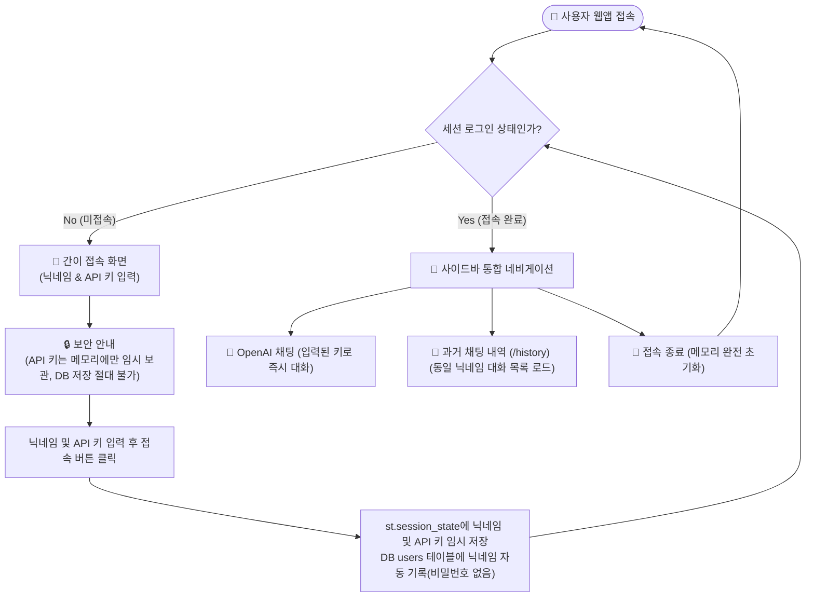

# 닉네임 및 API 키 기반 접속 시스템 개편 구현 계획서

회원가입 및 비밀번호 인증 체계를 전면 제거하고, 첫 화면에서 **닉네임**과 **OpenAI API 키**만 입력하면 즉시 접속되는 간이 접속 방식으로 개편합니다.
입력한 닉네임이 일치할 경우 기존 대화 내역을 그대로 불러오며, API 키는 DB나 로컬 저장소에 저장되지 않고 세션 메모리(`st.session_state`)에서만 안전하게 관리됩니다.

---

## 🗺️ 기능도 및 시스템 흐름도



---

## 1. 주요 핵심 사항 (확인 필요)

> [!IMPORTANT]
> **DB 비밀번호 데이터 영구 제거**
> - 기존 `chat_history.db`의 `users` 테이블에서 `password` 컬럼 및 기존 비밀번호 데이터를 완전히 삭제합니다.
> - 기존 닉네임(`username`)과 대화방 목록(`sessions`), 메시지 내역(`messages`)은 그대로 보존되어 기존 닉네임을 입력하면 이전 대화 내역을 정상적으로 불러옵니다.

> [!NOTE]
> **API 키 보안 정책**
> - 접속 시 입력한 OpenAI API 키는 Streamlit 세션 메모리(`st.session_state.openai_api_key`)에만 휘발성으로 보관됩니다.
> - 데이터베이스(`chat_history.db`), 파일(`.env` 등) 어디에도 기록되지 않으며 접속 종료 또는 브라우저 닫기 시 소멸합니다.

---

## 2. 세부 변경 계획

### [1] 데이터베이스 계층 (`modules/database.py`)
- **`users` 테이블 스키마 정리**:
  - `password` 컬럼을 제거하고 `(username TEXT PRIMARY KEY, created_at TIMESTAMP DEFAULT CURRENT_TIMESTAMP)` 구조로 변경.
  - `init_db()` 실행 시 기존 `users` 테이블에 `password` 컬럼이 남아있다면 `ALTER TABLE users DROP COLUMN password`를 실행하여 기존 비밀번호 데이터를 완전히 제거.
- **인증 함수 정리 및 닉네임 등록 함수 추가**:
  - 기존 `register_user`, `authenticate_user` 함수 제거.
  - 닉네임 접속 시 등록/확인하는 `get_or_create_user(username)` 함수 추가 (`INSERT OR IGNORE INTO users (username) VALUES (?)`).
- **세션 및 메시지 로직 유지**:
  - `get_sessions(username)` 및 `load_messages(session_id)`는 기존과 동일하게 닉네임 기준으로 대화 내역을 불러오므로 완벽하게 호환 유지.

---

### [2] 접속 화면 계층 (`modules/auth.py`)
- **회원가입/비밀번호 UI 제거**:
  - 탭 분리(로그인/회원가입), 비밀번호 입력 필드, 비밀번호 확인 필드, 비밀번호 평문 경고 배너 전면 삭제.
- **새로운 접속 UI 구성**:
  - 화면 타이틀: `🚀 시작하기`
  - 닉네임 입력창: `st.text_input("닉네임", placeholder="대화에 사용할 닉네임을 입력하세요")`
  - API 키 입력창: `st.text_input("OpenAI API 키", type="password", placeholder="sk-...")`
  - 보안 안내 문구: "입력하신 API 키는 세션 메모리에만 임시 보관되며, DB나 파일에 절대 저장되지 않습니다."
  - **접속하기** 버튼:
    - 닉네임과 API 키 입력 여부 검증.
    - `get_or_create_user(username)` 호출.
    - 세션 상태 갱신:
      - `st.session_state.logged_in = True`
      - `st.session_state.username = nickname.strip()`
      - `st.session_state.openai_api_key = api_key.strip()`
      - `st.session_state.messages = []`
      - `st.session_state.current_session_id = None`
    - `st.rerun()`으로 메인 채팅 화면 즉시 진입.

---

### [3] 메인 앱 및 네비게이션 (`app2.py`)
- **접속 상태 제어**:
  - 미접속 상태일 때 접속 화면(`modules/auth.py`) 표시.
  - 접속 후 사이드바 상단에 `👤 {username}님 접속 중` 및 `🚪 접속 종료` 버튼 제공.
  - 접속 종료 시 세션 상태(`username`, `openai_api_key`, `logged_in`, `messages`, `current_session_id`) 완전 초기화.
- **채팅 흐름 연동**:
  - 첫 화면에서 이미 API 키를 입력받았으므로, 별도 등록 절차 없이 진입 즉시 채팅창이 활성화되어 바로 대화 가능.

---

## 3. 검증 계획

### [1] 자동/CLI 검증
- Python 구문 검사:
  ```powershell
  uv run python -m py_compile app2.py modules/auth.py modules/database.py modules/api_key.py
  ```
- SQLite 스키마 및 컬럼 검증:
  ```powershell
  uv run python -c "import sqlite3; conn = sqlite3.connect('chat_history.db'); print('users columns:', [c[1] for c in conn.execute('PRAGMA table_info(users)').fetchall()]); print('users rows:', conn.execute('SELECT * FROM users').fetchall()); conn.close()"
  ```
  - `password` 컬럼 및 데이터가 완전 소멸되었는지 확인.

### [2] 수동 브라우저 검증
1. `run.bat` 또는 `uv run streamlit run app2.py` 실행.
2. 첫 화면에서 기존 사용자 닉네임(예: `Kong`)과 OpenAI API 키 입력 후 "접속하기" 클릭.
3. 기존 사용자의 대화 세션 목록과 메시지 내역이 정상적으로 복원되는지 확인.
4. 신규 닉네임(예: `Alice`) 입력 시 새로운 대화방으로 정상 진입되는지 확인.
5. 접속 종료 버튼 클릭 시 세션 메모리가 깨끗하게 초기화되어 첫 화면으로 이동하는지 확인.
6. DB 파일(`chat_history.db`)을 확인하여 API 키가 어디에도 저장되지 않았는지 최종 점검.
